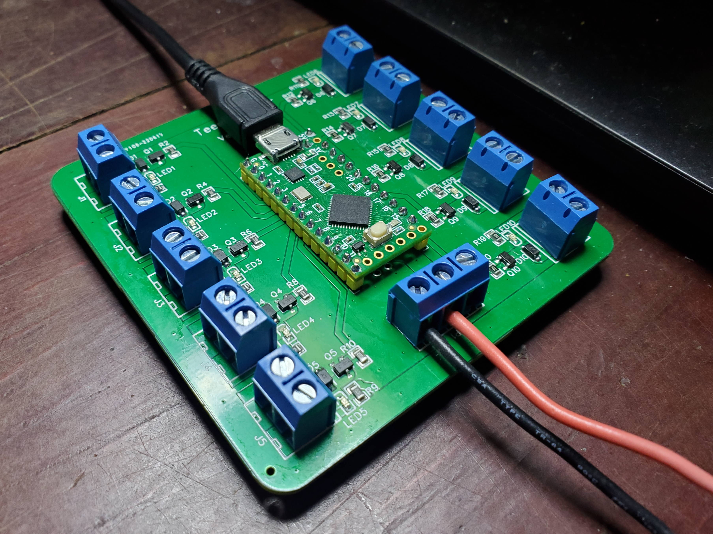
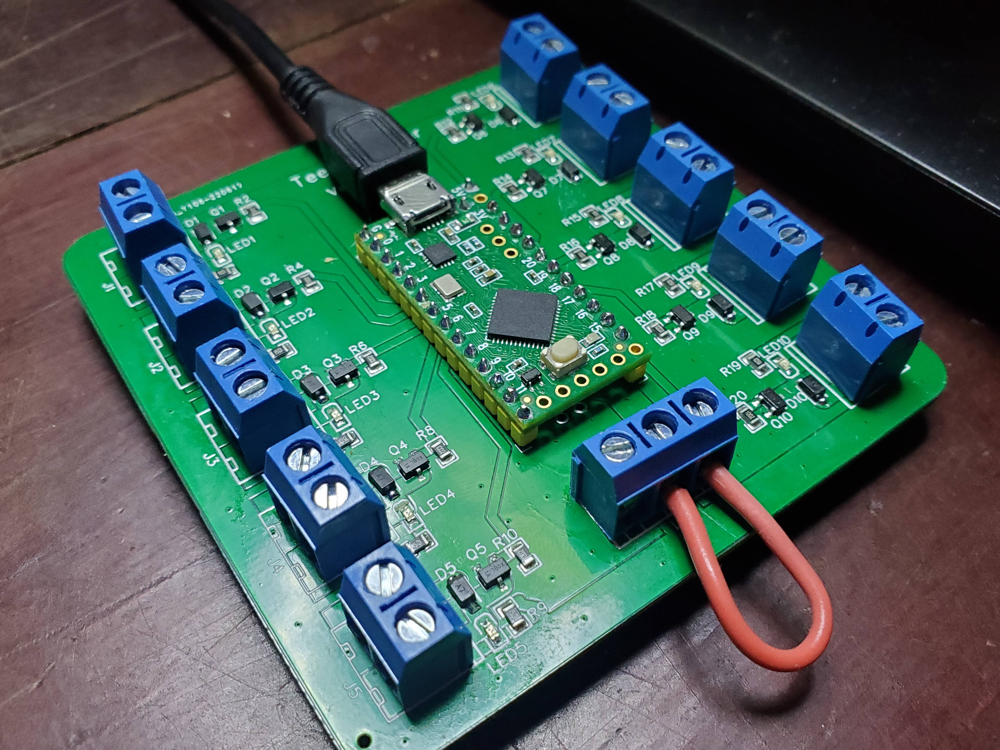

# Teensy FETer

A small board with 10 power outputs driven from FETs configured as high side switches and controlled by a Teensy LC. This board was mainly created for experimenting with solenoids.

| Photo of board using external power |  Photo of board using USB power |
| ----------------------------------- |  ------------------------------ |
|  |  |

## Output pins

Each of the 10 outputs is controlled by a single Teensy pin:

| Output | Teensy pin |
| ------ | ---------- |
| OUT1   | 2          |
| OUT2   | 3          |
| OUT3   | 4          |
| OUT4   | 5          |
| OUT5   | 6          |
| OUT6   | 23         |
| OUT7   | 22         |
| OUT8   | 21         |
| OUT9   | 20         |
| OUT10  | 19         |

## Usage notes

The "external power" pin (centre of the 3 pin screw terminal) is connected to the first pin of each of the output connectors (2 pin screw terminals). These aren't clearly labelled on the v1.0 boards, so if you're unsure look at the bottom of the board and follow the thick copper trace going around the outside of the board.

Whatever power is connected to the "external power" pin will supply power to whatever load you've connected to the output connectors (e.g. a solenoid). The LEDs on the board are also driven from the "external power".

There are two principle ways of using this board, which are shown in the photos above and described in more detail in the paragraphs below.

### Configuration 1 - External power supply

This board can be powered from an external power by connecting it pins 1 and 2 of the 3 pin screw terminal as shown in the photo above (the one on the left). Ground from the external supply should be connected to pin 1 and power to pin 2.

In this configuration the external power supply is connected to the "external power" pin and will, as described above, power the loads connected to the output connectors.

By default, the "external power" is not connected to the Teensy's power rails, which means:

* the Teensy will not be powered from the external power supply and must instead be powered from another source (e.g. from USB)
* you can connect a higher voltage to the "external power" pin than the Teensy allows (e.g. 12 volts)

However, the "external power" pin and the Teensy's VUSB pin can be linked together by linking pins 2 and 3 on the 3 pin screw terminal (as shown in the right side photo above). If you do this while providing power to the "external power" pin from an external power supply then the Teensy AND the output connectors will be powered from the external power supply - you should only do this if suppling a voltage the Teensy allows on it's VUSB pin (e.g. 5 volts) and no other power is connected to the Teensy (e.g. don't have USB power connected at the same time).

### Configuration 2 - USB power

By linking pins 2 and 3 on the 3 pin screw terminal (as shown in the right side photo above) and not providing any external power supply, the outputs and the Teensy can be powered from the Teensy's USB power.

This is useful for testing and for when you only need to control low power devices with the boards outputs (e.g. small 5V solenoids). Be aware that USB power doesn't usually supply much current (generally limited to 1 amp) and it a computer is supplying the USB power it may cut you off if you try to draw more than it allows.

## TODO

* [ ] TODO: Add silkscreen labels on 2 pin screw terminals
* [ ] TODO: Add silkscreen labels on 3 pin screw terminals
* [ ] TODO: More example code?

## Licence

Copyright © 2021, 2022 Phil Baldwin

This work is licensed under a Creative Commons Attribution-ShareAlike 4.0 International License.

You should have received a copy of the license along with this work. If not, see <http://creativecommons.org/licenses/by-sa/4.0/>.
